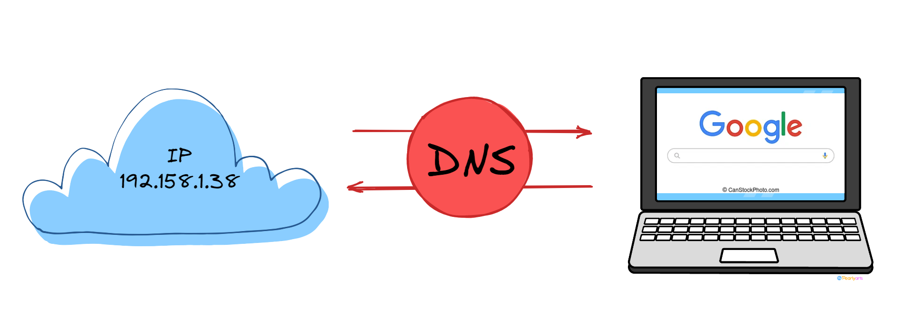
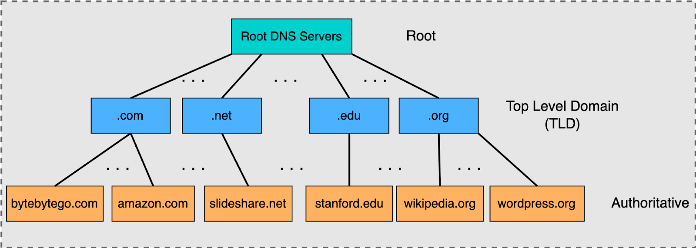

# What is DNS?

DNS (Domain Name System) provides a simple way for us to communicate with devices on the internet without remembering complex numbers. Much like every house has a unique address for sending mail directly to it, every computer on the internet has its own unique address to communicate with it called an IP address.  
An IP address looks like the following: `104.26.10.229`, 4 sets of digits ranging from 0–255 separated by a period. When you want to visit a website, it's not exactly convenient to remember this complicated set of numbers, and that's where DNS can help. Instead of remembering `57.144.136.1`, you can simply remember `facebook.com`.

---

## Domain Hierarchy

### TLD (Top-Level Domain)
A TLD is the rightmost part of a domain name. For example, the TLD for Facebook is `.com`. There are two types of TLDs: **gTLD** (Generic Top-Level Domain) and **ccTLD** (Country Code Top-Level Domain).  

- Historically, **gTLDs** were used to indicate the purpose of the domain name: `.com` for commercial purposes, `.org` for organizations, `.edu` for education, and `.gov` for government sites.  
- **ccTLDs** are used for geographical purposes, such as `.ca` for Canada or `.co.uk` for the United Kingdom.  

Due to high demand, there has been an influx of new gTLDs like `.online`, `.club`, `.website`, `.biz`, and many more. For a full list of over 2000 TLDs, check out the following:  
[Full List of TLDs](https://data.iana.org/TLD/tlds-alpha-by-domain.txt)

### Second-Level Domain
Using `tryhackme.com` as an example:  
- The `.com` part is the TLD.  
- `tryhackme` is the **Second-Level Domain**.  

When registering a domain name, the second-level domain is limited to 63 characters + the TLD. It can only contain `a-z`, `0-9`, and hyphens (but cannot start or end with hyphens or have consecutive hyphens).

### Subdomain
A subdomain sits on the left-hand side of the Second-Level Domain, separated by a period. For example, in `admin.tryhackme.com`, the `admin` part is the subdomain. Subdomain names follow the same creation rules as Second-Level Domains: they are limited to 63 characters and can only use `a-z`, `0-9`, and hyphens.  

Multiple subdomains can be chained together with periods to create longer names, like `jupiter.servers.tryhackme.com`, as long as the total length is under 253 characters. There is no limit to the number of subdomains you can create for a domain name.

---

## DNS Record Types
DNS isn't just for websites; multiple types of DNS records exist, each serving a specific purpose:

- **A Record**: Resolves to IPv4 addresses, e.g., `104.26.10.229`.  
- **AAAA Record**: Resolves to IPv6 addresses, e.g., `2606:4700:20::681a:be5`.  
- **CNAME Record**: Resolves to another domain name. For example, `store.tryhackme.com` resolves to a CNAME record `shops.shopify.com`. Another DNS request is made to `shops.shopify.com` to find its IP address.  
- **MX Record**: Specifies the address of mail servers handling email for a domain. For instance, an MX record for `tryhackme.com` might look like `alt1.aspmx.l.google.com`. MX records include a priority flag, which determines the order of servers to try in case of failure.  
- **TXT Record**: Stores free text data, commonly used for purposes like verifying domain ownership or authorizing email servers to prevent spam and spoofing.

---

## Making a DNS Request

What happens when you make a DNS request? Here's the process step by step:

1. Your computer checks its **local cache** to see if the address has been recently looked up.  
2. If not found, a request is sent to the **Recursive DNS Server**, typically provided by your ISP (though you can use alternatives like Google DNS or Cloudflare).  
3. If the Recursive DNS Server has the result cached, it sends the response back to your computer. If not, the request proceeds to the **root DNS servers**.  
4. The root servers redirect the request to the appropriate **Top-Level Domain (TLD) server**, depending on the domain's TLD (e.g., `.com`, `.org`).  
5. The TLD server provides information about the **Authoritative DNS Server**, which stores the DNS records for the requested domain.  
6. The Authoritative DNS Server sends the relevant DNS record back to the Recursive DNS Server, which caches it for future requests and relays it back to your computer.

Each DNS record includes a **TTL (Time To Live)** value, which specifies how long the response can be cached locally before another lookup is required. This caching mechanism significantly reduces the need for repeated DNS queries.  

